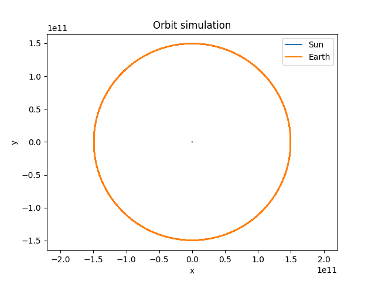

# Rust N-Body Simulation

A high-performance gravitational N-body simulator written in Rust with multiple visualization options.

## Goals

- Simulate orbital mechanics with high accuracy
- Explore numerical integration methods
- Demonstrate high-performance Rust capabilities
- Provide multiple visualization frontends (native GUI and web-based)

## Features

### Core Simulation
- **Modular simulation engine** - Flexible architecture for different physics integrators
- **Multiple integrators** - Euler and Leapfrog methods for numerical integration
- **Diagnostics and energy tracking** - Monitor energy conservation
- **JSON configuration** - Easy simulation setup via config files

### Visualization Modes

#### 1. **Native GUI** (macroquad)
- Real-time 2D rendering using macroquad
- Immediate visual feedback
- Low latency visualization

#### 2. **Web-based Frontend** (Vue.js)
- Modern Vue.js + TypeScript interface
- Interactive controls (play/pause/step)
- Adjustable simulation speed (16-500ms intervals)
- Mouse wheel and button zoom controls (0.1x - 10.0x)
- Live statistics (FPS, time, body count, zoom level)
- Responsive dark-themed UI
- REST API backend with CORS support

#### 3. **Headless Server Mode**
- REST API server for remote simulation control
- JSON data endpoints for integration with other tools

## Architecture

```
nbody-sim/
├── src/
│   ├── physics/          # Gravity calculations and body physics
│   ├── integrators/      # Numerical integration methods
│   ├── simulation/       # Simulation engine
│   ├── render/           # Native GUI rendering
│   ├── server/           # REST API server
│   ├── diagnostics/      # Energy tracking
│   ├── output/           # CSV export and plotting
│   └── config/           # Configuration management
└── nbody-frontend/       # Vue.js web frontend
    ├── src/
    │   ├── components/   # Vue components
    │   └── services/     # API client
    └── vite.config.ts    # Vite configuration
```

## Quick Start

### Option 1: Native GUI (Default)

```bash
cargo run -- --config config/simulation.json --integrator leapfrog
```

### Option 2: Web-based Visualization

**Terminal 1 - Start Rust backend server:**
```bash
cargo run -- --mode server --port 3000 --integrator leapfrog
```

**Terminal 2 - Start Vue.js frontend:**
```bash
cd nbody-frontend
npm install  # First time only
npm run dev
```

Then open your browser to `http://localhost:5173`

### Option 3: Headless Server Only

```bash
cargo run -- --mode server --port 3000
```

## Command Line Options

```bash
cargo run -- [OPTIONS]

Options:
  -c, --config <FILE>        Path to simulation config [default: config/simulation.json]
  -i, --integrator <TYPE>    Integration method: euler, leapfrog [default: leapfrog]
  -m, --mode <MODE>          Run mode: gui, server [default: gui]
  -p, --port <PORT>          Server port (server mode only) [default: 3000]
```

## REST API Endpoints

When running in server mode:

- `GET /api/state` - Get current simulation state
- `GET /api/step` - Execute one simulation step and return new state
- `POST /api/start` - Start continuous simulation
- `POST /api/stop` - Stop simulation

## Configuration

Simulations are configured via JSON files. Example:

```json
{
  "dt": 1800.0,
  "steps": 10000,
  "bodies": [
    {
      "name": "Sun",
      "mass": 1.989e30,
      "position": [0.0, 0.0, 0.0],
      "velocity": [0.0, 0.0, 0.0],
      "color": "yellow"
    }
  ]
}
```

## Web Frontend Controls

- **Mouse Wheel** - Zoom in/out
- **+/- Buttons** - Precise zoom control
- **Reset Button** - Reset zoom to 1.0x
- **Play/Pause** - Control simulation playback
- **Step Once** - Execute single simulation step (when paused)
- **Speed Slider** - Adjust update interval

## Dependencies

### Rust Backend
- `nalgebra` - Linear algebra
- `axum` - Web framework
- `tokio` - Async runtime
- `macroquad` - Native GUI rendering
- `serde/serde_json` - Configuration parsing
- `tower-http` - CORS middleware

### Vue.js Frontend
- Vue 3 + TypeScript
- Axios for API communication
- Vite for development server

## Building

```bash
# Debug build
cargo build

# Release build (optimized)
cargo build --release

# Build Vue.js frontend for production
cd nbody-frontend
npm run build
```

## Examples

See `config/simulation.json` for a full solar system simulation configuration.



## Performance

The Rust backend provides high-performance simulation with minimal overhead. The web frontend can maintain 60 FPS for real-time visualization while the simulation runs independently on the backend.

## License

See LICENSE file for details.
